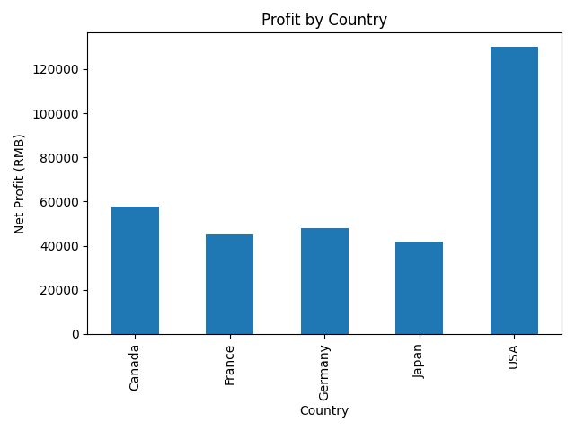
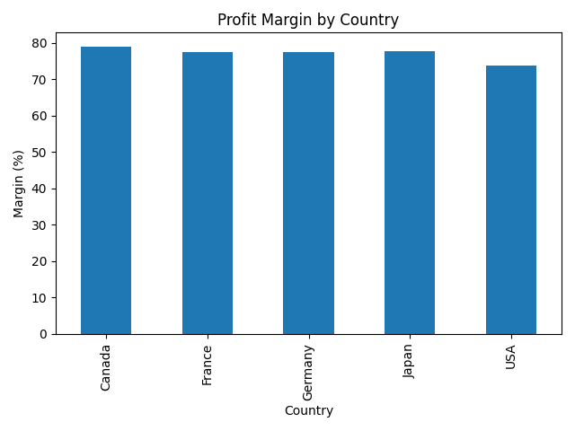

# Finance Analytics Dashboard

A business-focused analytics project for tracking financial KPIs and transaction trends.

## Overview

This project analyzes trade data to identify key financial insights such as profit distribution and margin performance across countries.

## Key Insights

- Identified top-performing countries by total profit
- Compared profit margins across different regions
- Visualized trends using Python

## Tech Stack

- Python
- Pandas
- Matplotlib

## Project Structure
data/ # raw data
src/ # analysis scripts
outputs/ # generated charts

## Sample Visualization

